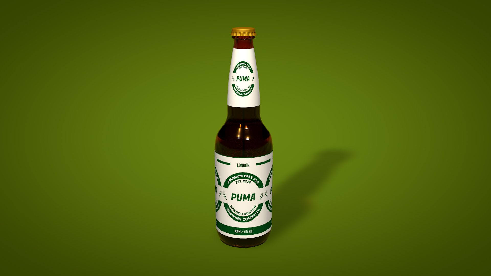

# Final Integrated Project

### Overview
This website is the brand machup between Alexander Keiths and Puma Speed-Orbiter. In the website, you will find 5 pages, including a home page, products, our brand, contact, and promotions page. All of the content was created by us for this project. 

### Getting Started
This is a basic HTML / CSS build.

To view the pages, clone this to the location of your choice, and open the ".html" file.

You can also view the source code by opening it in any code editing program of your choice, or clicking inspect in a chrome tab.

### Prerequisites
All you need to run these pages is an up to date browser.

## Authors
1. Greg Avery - Front End Dev @ Back end designer
2. Gerrit Acheson - Front end designer
